# Práctica Formativa Obligatoria 2: Prompt Engineering en Agentes de IA
* **Institución:** Instituto de Formación Técnica Superior N.° 29 (IFTS N.°29)
* **Estudiante:** Herrera Marcela Fernanda

---

## 📄 1. Descripción del Proyecto
. Consiste en una estructura modular compuesta por una **Interfaz de Acceso (Portada Principal/Hub)** que unifica y redirige de forma centralizada a los tres componentes requeridos.
1. **Link 1:** El texto plano del prompt de alta precisión utilizado para la generación.
2. **Link 2:** Landing Page generada de manera 100% autónoma por el **Primer Agente (Claude 3.5 Sonnet)**
3. **Link 3:** Landing Page generada de manera 100% autónoma por el **Segundo Agente (OpenAI Codex)**

El núcleo temático del entorno es **BioData AI**, una solución orientada a la biotecnología y el análisis de datos moleculares. 

---

## 🛠️ 2. Arquitectura y Herramientas Utilizadas
* **IDE de Desarrollo:** Cursor
* **Tecnologías Core:** HTML5 Semántico y CSS3 Moderno (Variables globales, Flexbox y CSS Grid).
* **Agentes de IA Evaluados:**
  * **Agente 1:** Claude 3.5 Sonnet (Integrado en Cursor)
  * **Agente 2:** OpenAI Codex (Modelo GPT-4.5 Mini)
---

## 🎯 3. Especificación del Prompt Inicial (Engine Prompt)
El prompt definitivo fue estructurado siguiendo las guías y buenas prácticas oficiales de ingeniería de instrucciones de **Anthropic** y **OpenAI** (asignando rol de Ingeniero Frontend Senior, contexto técnico, restricciones y formato de salida). El prompt exigió de manera estricta los **7 requisitos mínimos de maquetación**
1. **Cabecera** con menú de navegación funcional.
2. **Hero Section** con propuesta de valor y botón de llamada a la acción (*CTA: "Solicitar Demo"*)
3. **Sobre Nosotros** con descripción institucional.
4. **Sección de Servicios** o características principales estructuradas.
5. **Testimonios** o reseñas de clientes reales del sector.
6. **Formulario de contacto** limpio (maquetado visual sin backend)
7. **Pie de página (Footer)** con enlaces a redes sociales.

*Restricción de Evaluación:* Se respetó de forma estricta la consigna de **no modificar el código de forma manual**
permitiendo evaluar la efectividad y autonomía real de cada agente basado en la instrucción inicial

---

## 📸 4. Evidencia Visual y Galería Comparativa

### Interfaz de Acceso (Portada Principal - Hub)
La portada central de la aplicación distribuye las tarjetas de acceso de forma adaptabilidad responsiva según el dispositivo detectado:

<table width="100%">
  <tr>
    <td width="60%" align="center"><b>💻 Vista de Escritorio (1440px)</b></td>
    <td width="40%" align="center"><b>📲 Vista de Celular (390px)</b></td>
  </tr>
  <tr valign="top">
    <td>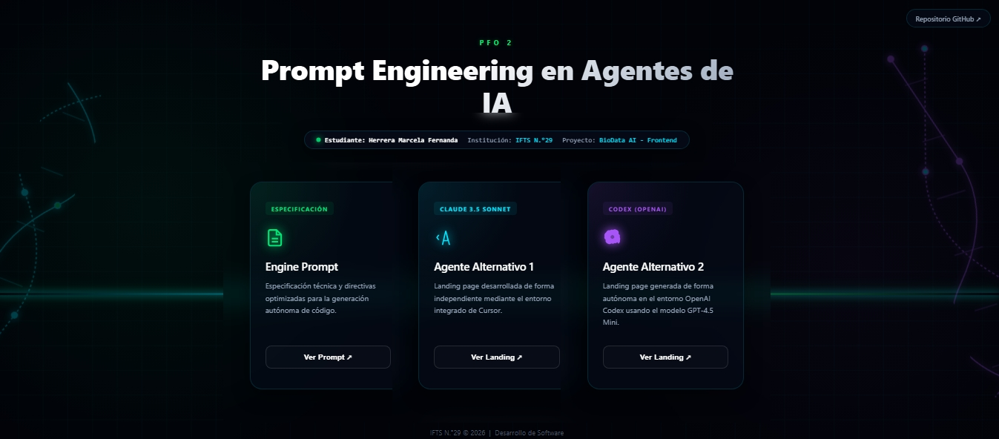</td>
    <td>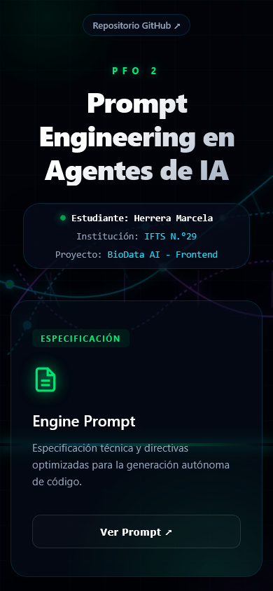</td>
  </tr>
</table>

---

### Comparativa: Agente 1 (Claude 3.5) vs. Agente 2 (Codex)
Evidencia visual del comportamiento autónomo de los bloques de construcción frontend generados por cada herramienta.

#### 🏛️  Cabecera, Hero Section y Llamada a la Acción (CTA)
<table width="100%">
  <tr>
    <td width="50%" align="center"><b>🤖 Agente 1 (Claude 3.5 Sonnet)</b></td>
    <td width="50%" align="center"><b>🤖 Agente 2 (OpenAI Codex)</b></td>
  </tr>
  <tr valign="top">
    <td></td>
    <td>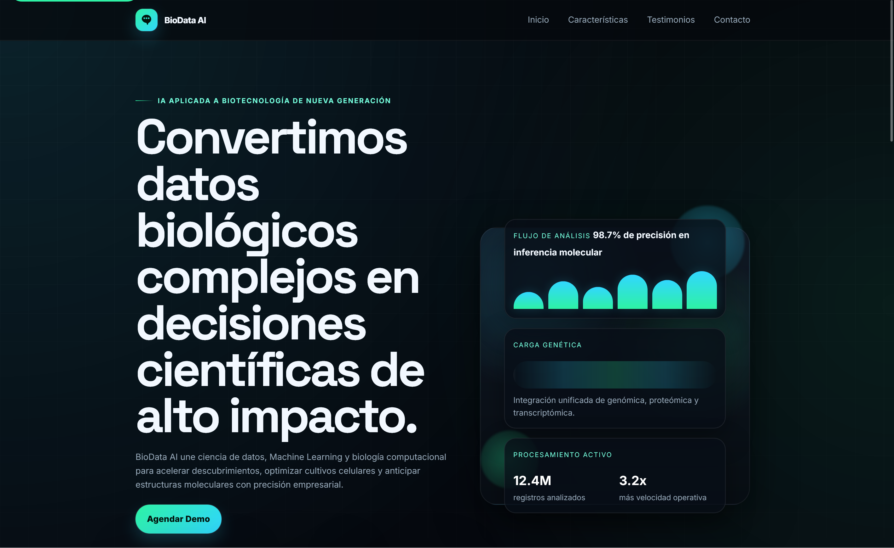</td>
  </tr>
</table>

#### 🧬 Descripción / Sobre Nosotros
<table width="100%">
  <tr>
    <td width="50%" align="center"><b>🤖 Agente 1 (Claude 3.5 Sonnet)</b></td>
    <td width="50%" align="center"><b>🤖 Agente 2 (OpenAI Codex)</b></td>
  </tr>
  <tr valign="top">
    <td>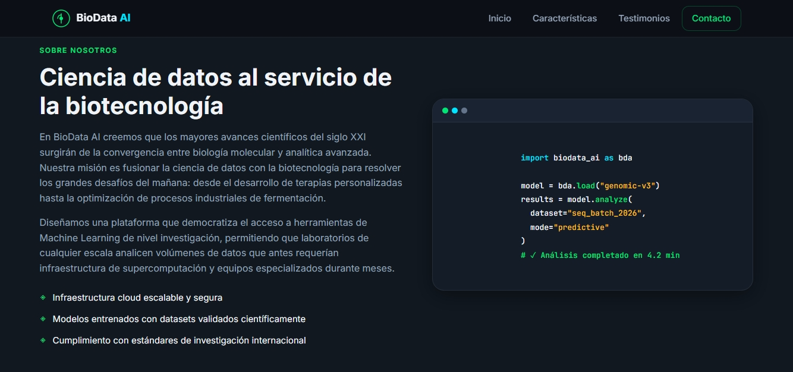</td>
    <td>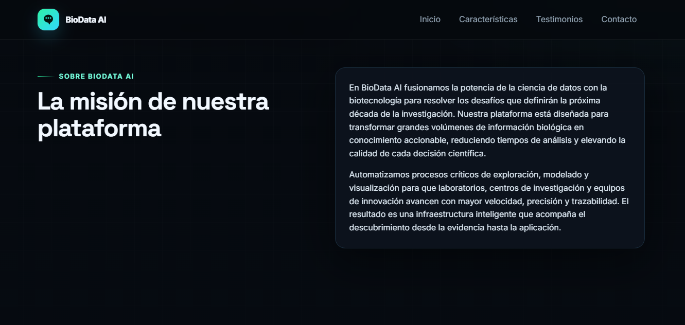</td>
  </tr>
</table>

#### 📊  Sección de Servicios / Características
<table width="100%">
  <tr>
    <td width="50%" align="center"><b>🤖 Agente 1 (Claude 3.5 Sonnet)</b></td>
    <td width="50%" align="center"><b>🤖 Agente 2 (OpenAI Codex)</b></td>
  </tr>
  <tr valign="top">
    <td>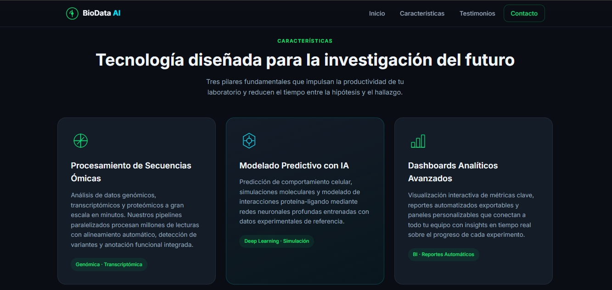</td>
    <td>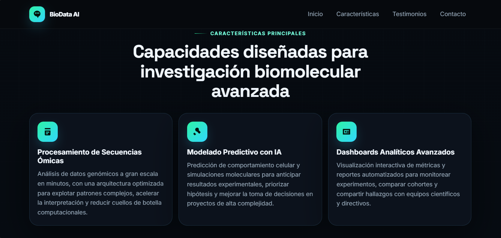</td>
  </tr>
</table>

#### 👥 Testimonios / Reseñas de Clientes
<table width="100%">
  <tr>
    <td width="50%" align="center"><b>🤖 Agente 1 (Claude 3.5 Sonnet)</b></td>
    <td width="50%" align="center"><b>🤖 Agente 2 (OpenAI Codex)</b></td>
  </tr>
  <tr valign="top">
    <td>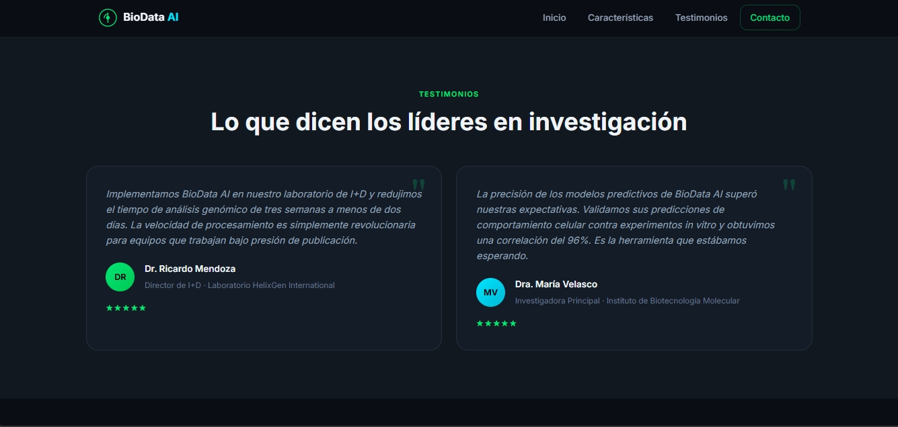</td>
    <td>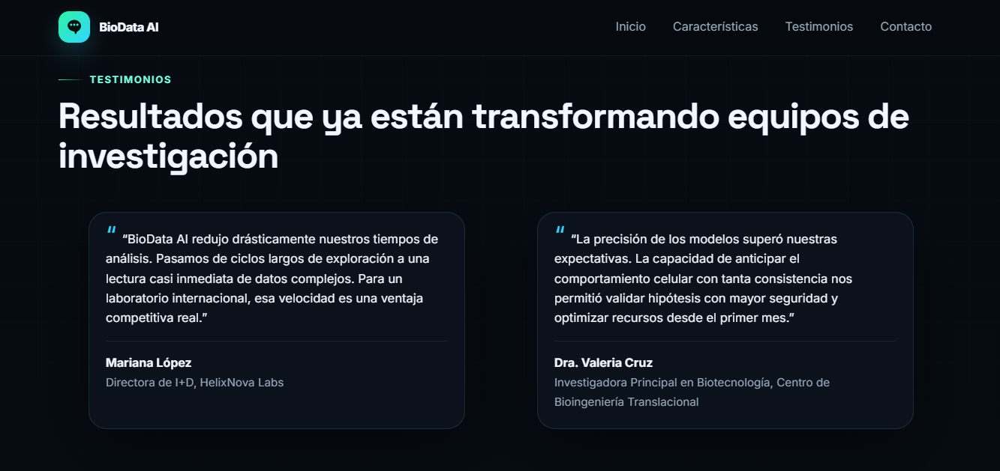</td>
  </tr>
</table>

#### 📩 Formulario de Contacto Visual
<table width="100%">
  <tr>
    <td width="50%" align="center"><b>🤖 Agente 1 (Claude 3.5 Sonnet)</b></td>
    <td width="50%" align="center"><b>🤖 Agente 2 (OpenAI Codex)</b></td>
  </tr>
  <tr valign="top">
    <td>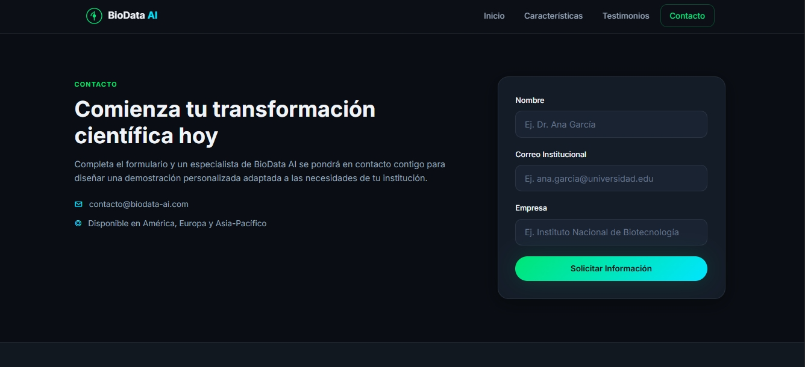</td>
    <td>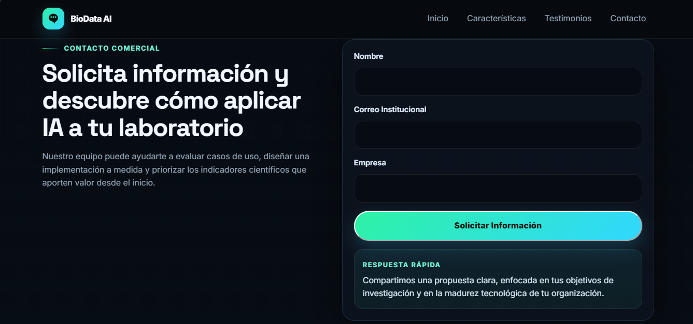</td>
  </tr>
</table>

#### 🔗 Pie de Página (Footer) y Enlaces  a Redes Sociales
<table width="100%">
  <tr>
    <td width="50%" align="center"><b>🤖 Agente 1 (Claude 3.5 Sonnet)</b></td>
    <td width="50%" align="center"><b>🤖 Agente 2 (OpenAI Codex)</b></td>
  </tr>
  <tr valign="top">
    <td>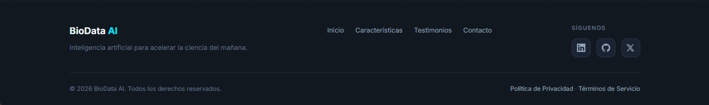</td>
    <td>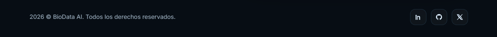</td>
  </tr>
</table>

---

## 🔗 6. Enlaces de Acceso al Despliegue
* **Link al Repositorio :**
* **Link al Deploy Unificado (Vercel):** 
